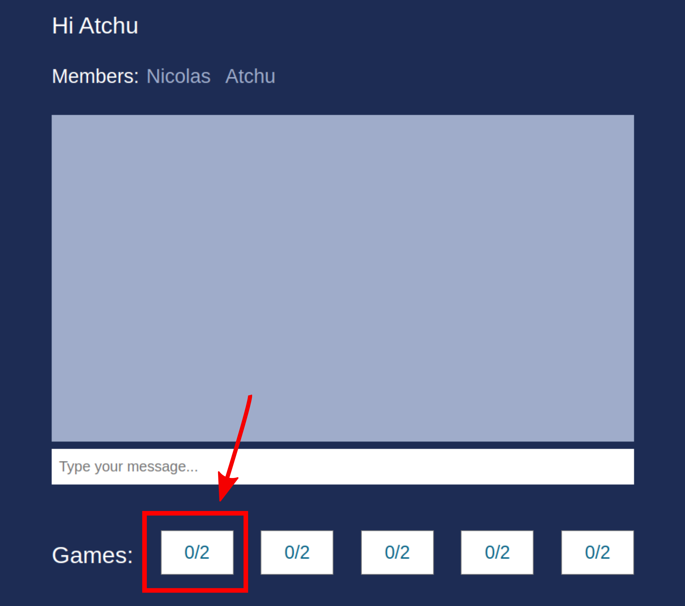
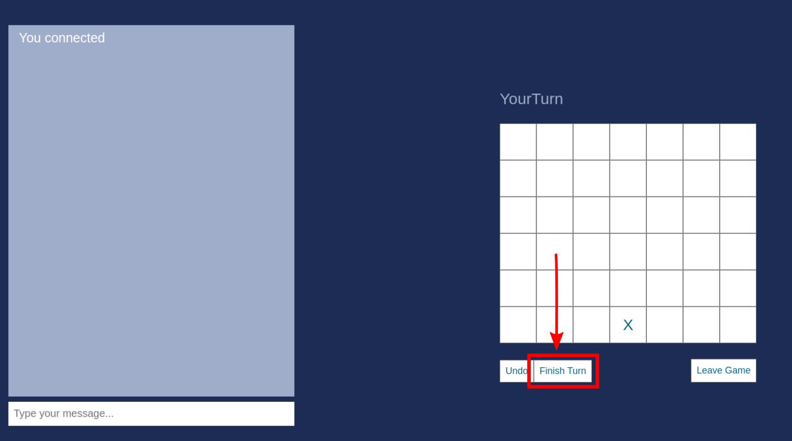
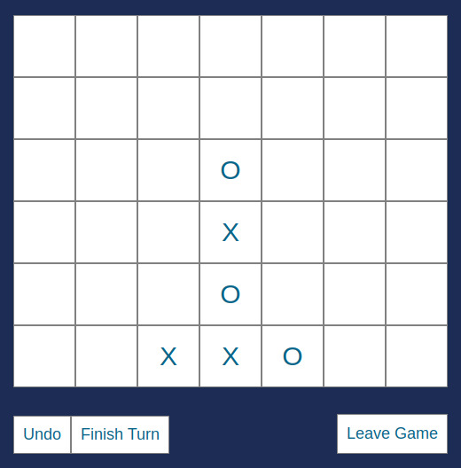
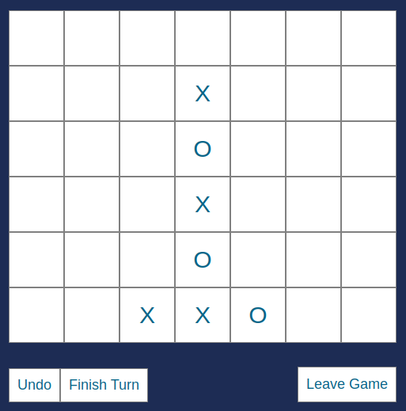
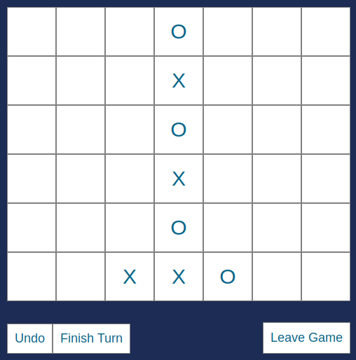
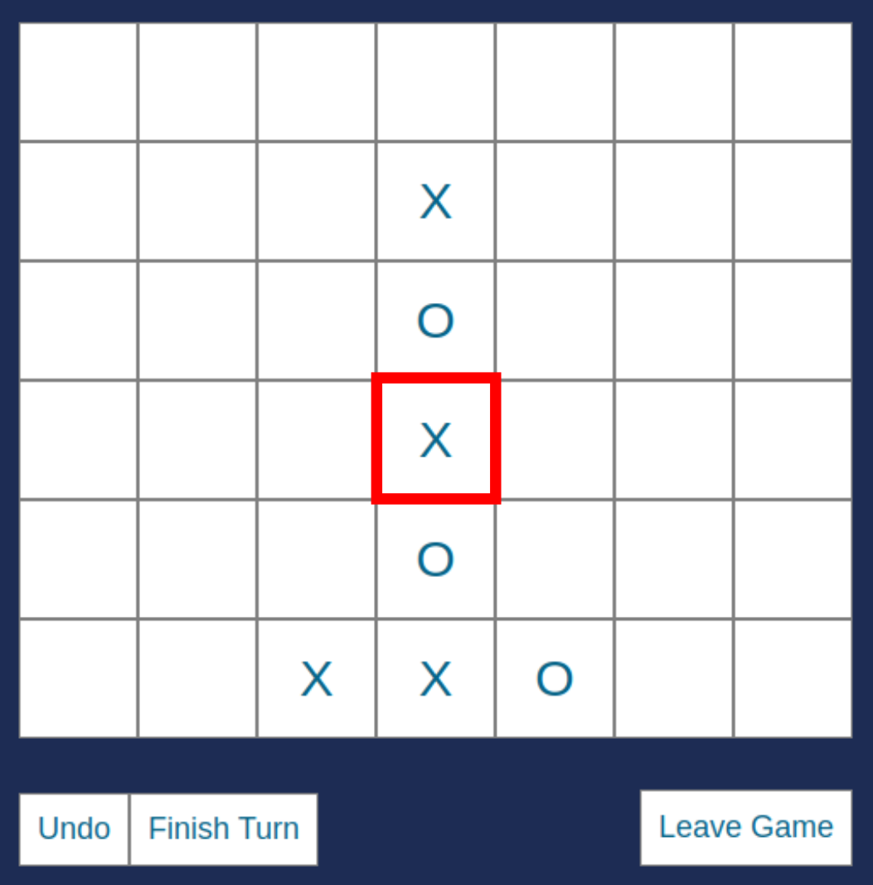
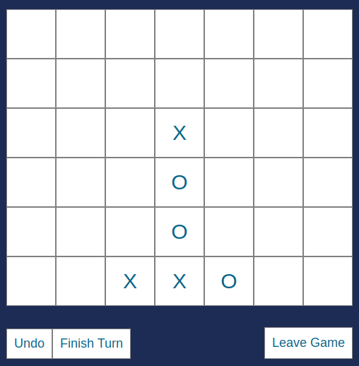
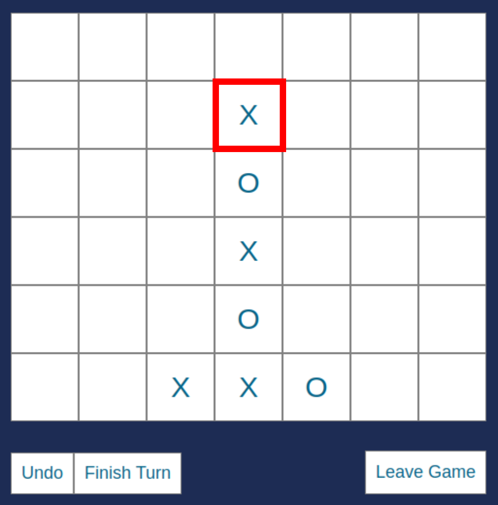

# Connect Four but with a Twist
Multiplayer online webapplication of the connect four game with a special rule.  
Test it: [Online Demo](http://connect4.nimulia.com/)

## Motivation
The orignal connect four game is solved. Meaning that we
know the prefect strategy. In fact the player with the first move always wins. In order to give the game a new twist we
introduce a new Rule (Delete stones as a move), which makes the game more interesting. Since the new rule makes it difficult to play the game on paper, I implemented this webapplication.

## How to play
1. Open two tabs (Player A and Player B) and open in each: [Online Demo](http://connect4.nimulia.com/)
2. Enter a Username for A and B
3. Player A: Click one of the five game lobbies 

4. Player B: Join the same game as A
5. Player B: Click one of the squares where you want to place your stone. Then click Finish Turn. 

6. Player A: Click one of the squares where you want to place your stone. Then click Finish Turn.
7. Repeata step 5 and 6 until someone wins or forfeits.

### Rules
- Normal Connect four rules
- **Special Rule**: Instead of placing your stone, you can choose to delete a stone of the enemy as your move resulting in the other stones falling down by one. Further you are only allowed to delete if the resulting game state has never seen before (This prevents that you just delete the stone the enemy just set in his last turn)   
### Example of Special Rule 
Lets assume we are in the following state (1) which was Player B's turn: 
  
Then Player A sets his stone (X), which resulted in the following state (2) 

 
Now it's player B's turn. He can now choose to make a normal move, which would for example result in state (3).  

 
However he can also choose to use the **Special Rule** and delte a stone from Player A which could result in state (4)  

=>

 
What happend is that the stone from A in the red rectangle got delted abd the stones above (O and X) fell down by one place. 
Note that B could not have deleted the following stone:  

 
Because the resulting state of the board would be the same as in state (1), which is not allowed, since each state needs to be a never before seen state.